

  

# Marvel Heroes

Este repositório é o resultado do desafio técnico para **Superlógica**

Foi desenvolvido um simples app com os requisitos técnicos deste [documento](README_ORIGINAL.md).

Adicionei 3 funcionalidades além dos requisitos técnicos.

- Theme **dark e light** por toggle button no header
- **Share** para redes sociais e apps
- **Open url** de series e eventos dos personagens quando disponível

>  O prazo para entrega do desafio no documento especifica uma semana, mais me foi solicitado em 4 dias.  Para não descumprir o solicitado cheguei ao resultado abaixo em 4 dias.  Não tive mais tempo para fazer melhorias de arquitetura, refatoração, performance e design.  Agradeço a **Superlógica** pelo desafio e desejo sucesso para todos.  

## Preview

  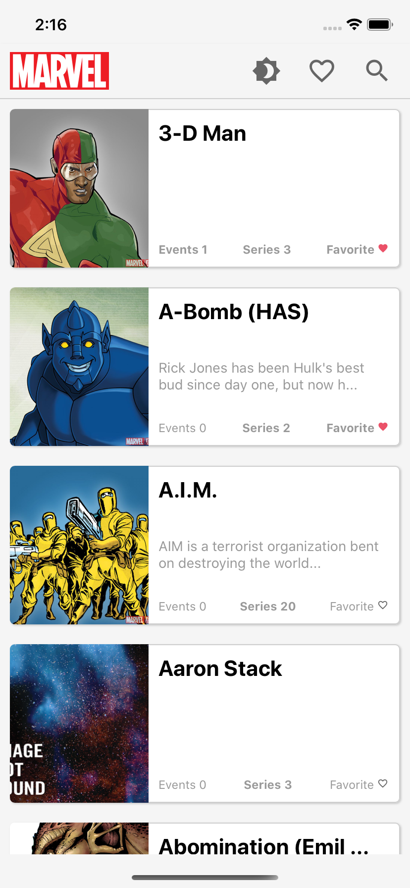
  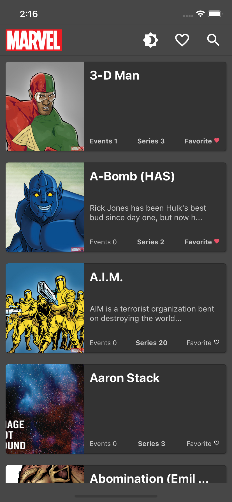

  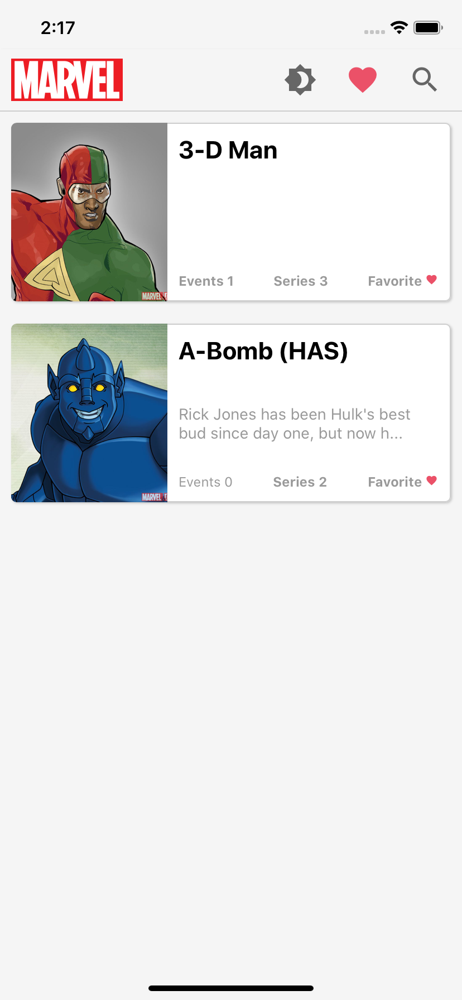
  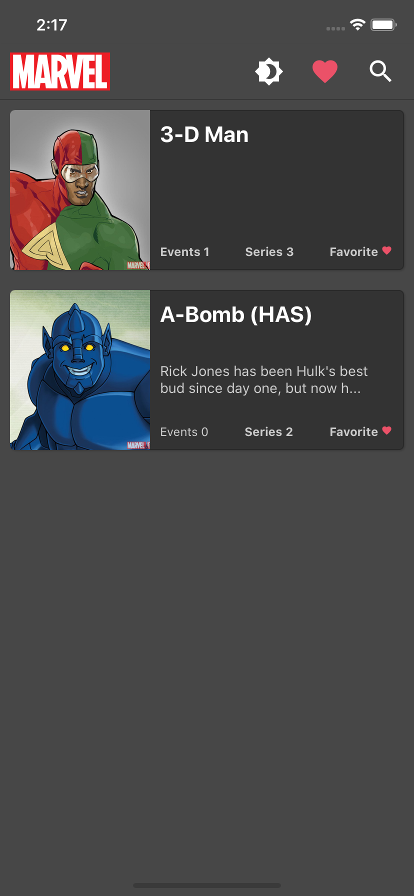

  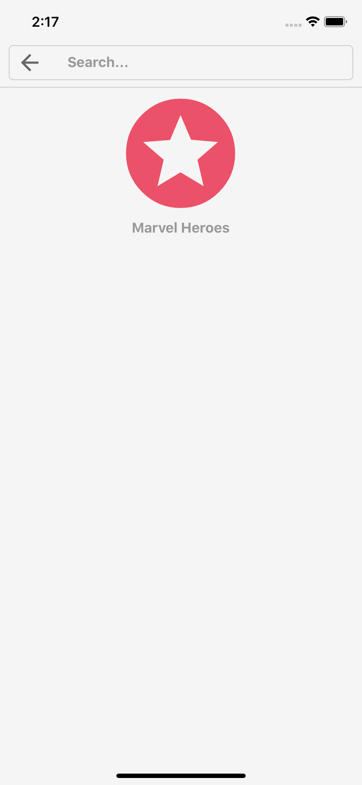
  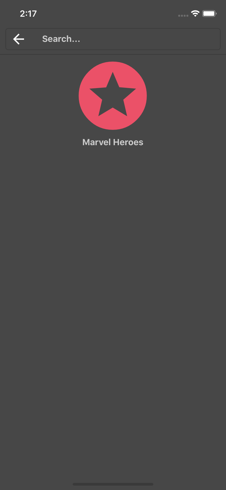

  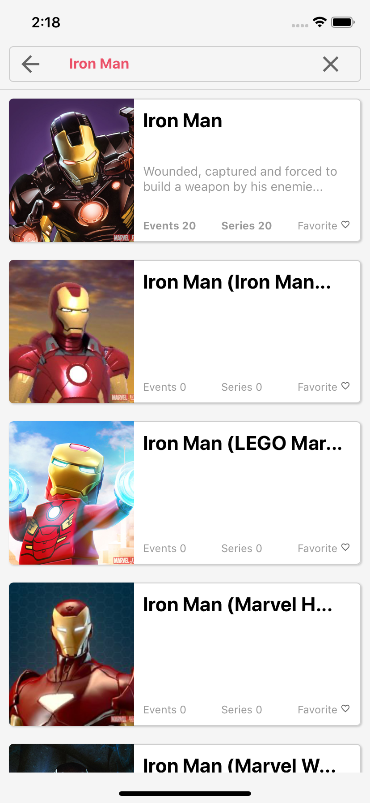
  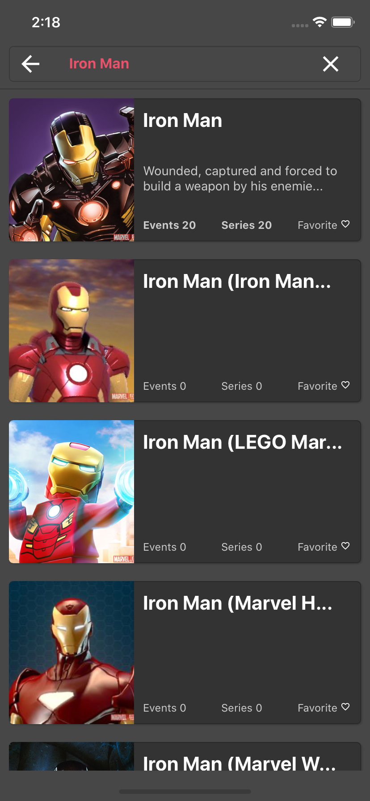

  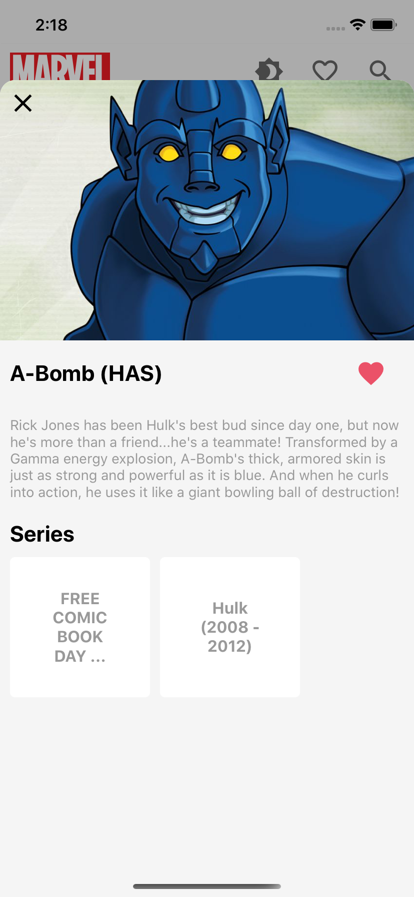
  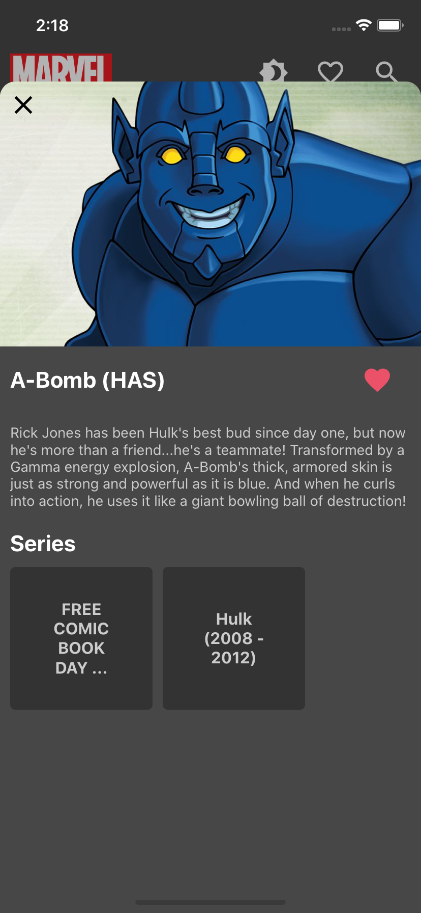

  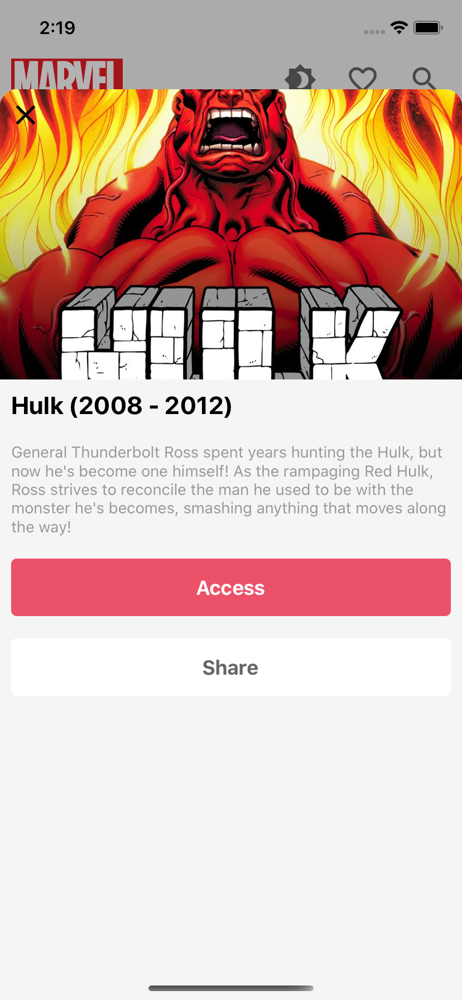
  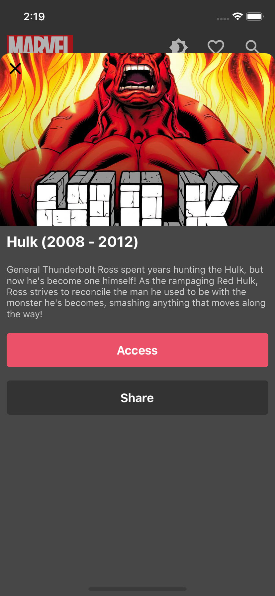

